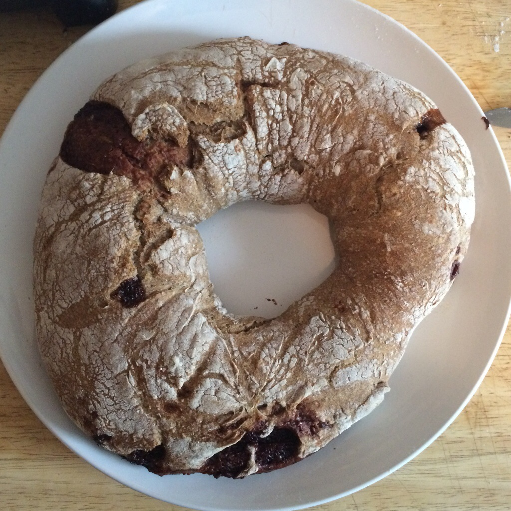

hi! how are you?

_bread_

let's talk about it

i _♥︎_ bread

i _make_ my own bread now

_so_

making bread helped me become a _better programmer_

maybe it will help _you_

why did it help?

5 reasons

_one_

embrace your _fears_!

i was _never good_ at baking

or so i thought

for me it was fear of getting things _wrong_

when i fear something, i try to understand it

_two_

food x mixing + heat = baking

learn _components_

they fit _together_

learn _why_ they make _patterns_

_three_

_patterns_ are useful.

there are _patterns for bread_

_maybe?_

i'm not talking about that, tho

[Artisan Bread in Five](http://www.artisanbreadinfive.com/)

_four_

patterns alone ≠ _tasty_

they need to be implemented in a _larger context_

patterns _influence_ implementation

_poolish_

_five_

learn _other styles_

you might _not_ like them

that's _OK_

might not use them _every day_

but sometimes you _put them together_

and you get the _unexpected_

_buckwheat_

_chocolate_

_swirl_

in sum

learn from _surprising_ places

_next year_

_cheese?_

(thanks)

[poolish foto cc-by-nc-sa haley j.](https://www.flickr.com/photos/haleysuzanne/3549752226)

@anarchivist