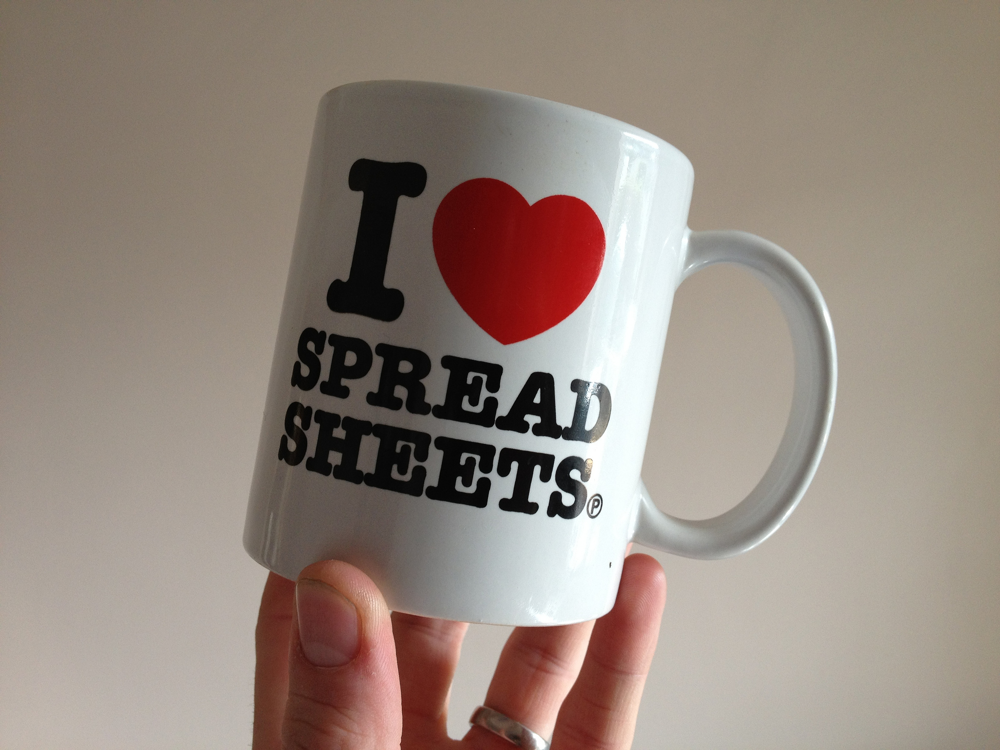
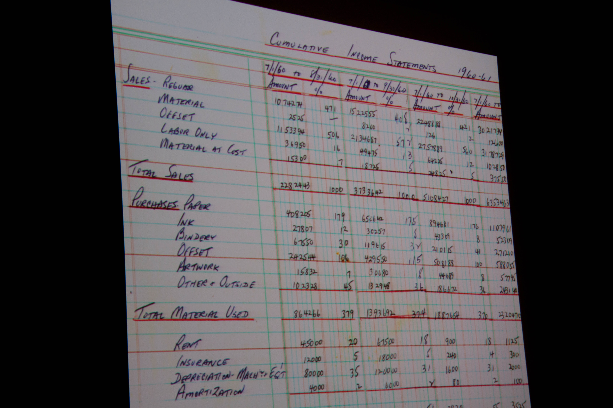
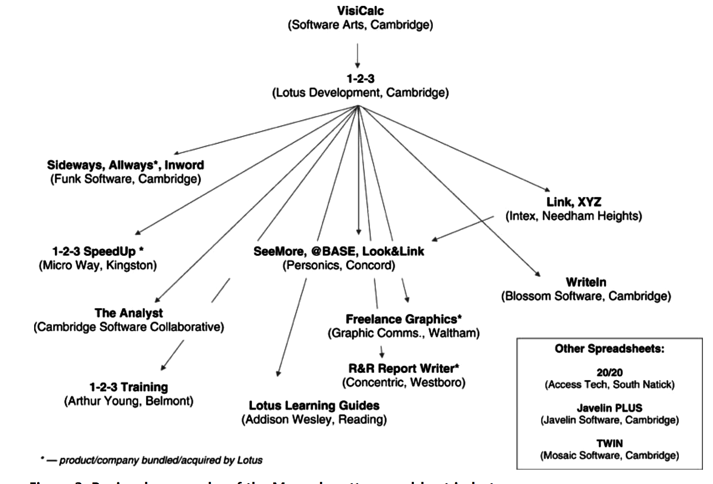
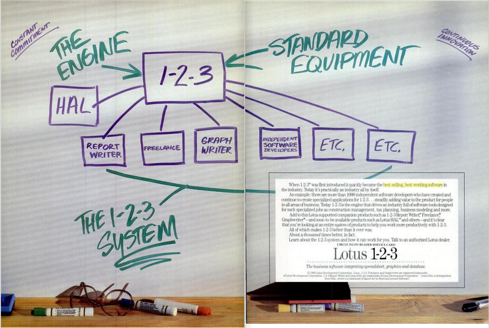

EVER TO EXCEL: TOWARDS AN APOLOGETICS OF THE SPREADSHEET  MARK A. MATIENZO @ANARCHIVIST CODE4LIB 2016

                 [ORIGINAL PHOTO BY CRAIG MOULDING](http://www.flickr.com/photos/craigmoulding/8399214678/)

HOW OFTEN DO YOU USE SPREADSHEETS?

HOW DO YOU FEEL WHEN YOU USE SPREADSHEETS?

                 [ORIGINAL PHOTO BY MIRKO TOBIAS SCHÄFER](https://www.flickr.com/photos/gastev/3794926057)

SPREADSHEET = DATA & PROGRAM

SPREADSHEETS ADDRESS USER NEEDS

                [ORIGINAL PHOTO BY BETSY WEBER; SLIDE BY DAN BRICKLIN](https://www.flickr.com/photos/gastev/3794926057)

"WHY WOULD A MANAGER WANT TO DO A SPREADSHEET ON ONE OF THOSE 'TOY' COMPUTERS? WHAT WERE SECRETARIES AND ACCOUNTANTS AND THE PEOPLE DOWN IN [DATA PROCESSING] FOR?"  [STEVEN LEVY, "A SPREADSHEET WAY OF KNOWLEDGE," HARPER'S, NOVEMBER 1984](https://backchannel.com/a-spreadsheet-way-of-knowledge-8de60af7146e)

SPREADSHEETS EMPOWER USERS AND CHANGE THEIR RELATIONSHIP TO&nbsp;PROGRAMMING

CONSTRAINTS

"A SPREADSHEET MODEL IS GROUNDED IN THE DISTINCT TABULAR FORMAT OF ROWS AND COLUMNS, AND IS CONSTRUCTED IN SUCCESSIVE APPROXIMATIONS AS THE USER CRITIQUES THE EMERGING MODEL."  [BONNIE NARDI AND JAMES MILLER, "THE SPREADSHEET INTERFACE: A BASIS FOR END-USER PROGRAMMING." HUMAN-COMPUTER INTERACTION: INTERACT '90](http://www.miramontes.com/writing/spreadsheet-eup/)

"IF ANYTHING, THE BIG BREAK WITH THE VISICALC WAS THE GRID THAT ACTUALLY REDUCED THE AMOUNT OF INTERACTIVITY."  [BOB FRANKSTON, IN "PC SOFTWARE WORKSHOP: VISICALC," 2004. CHM REFERENCE ID #X4276.2008](http://www.computerhistory.org/collections/catalog/102658146)

SPREADSHEETS AND THE CREATION OF ENVIRONMENTS OF SUPPORT

                     [MARTIN CAMPBELL-KELLY, "NUMBER CRUNCHING WITHOUT PROGRAMMING: THE EVOLUTION OF SPREADSHEET USABILITY," IEEE ANNALS OF THE HISTORY OF COMPUTING, 2007](http://dx.doi.org/10.1109/MAHC.2007.43)

                  [PC MAGAZINE, OCTOBER 28, 1986 (8-9), QUOTED IN CAMPBELL-KELLY](https://books.google.com/books?id=MK_-L8Mr1u4C&lpg=PA9&dq=%22best%20selling%20best%20working%20software%22&pg=PA8#v=onepage&q=%22best%20selling%20best%20working%20software%22&f=false)

SPREADSHEETS AND CO&#8209;DEVELOPMENT: BRIDGING DOMAIN KNOWLEDGE

HOW DO WE GET THERE?

&#xE080; THANKS! &#xE010;   @ANARCHIVIST MATIENZO.ORG